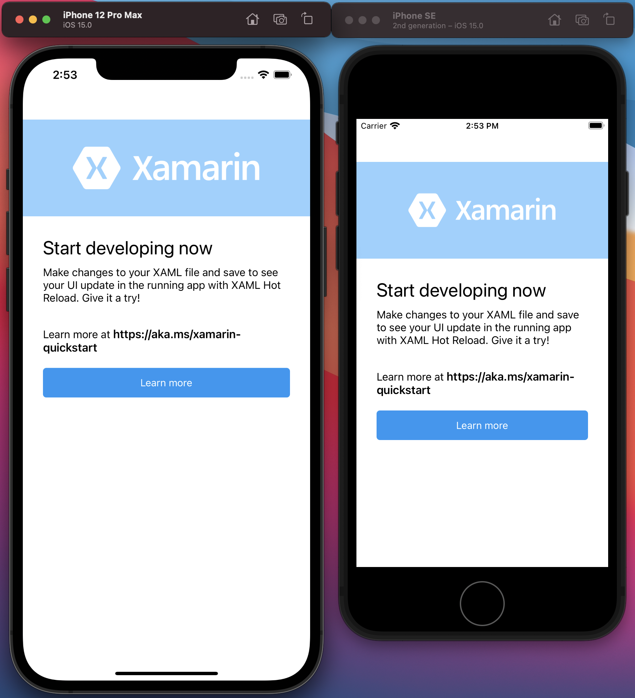
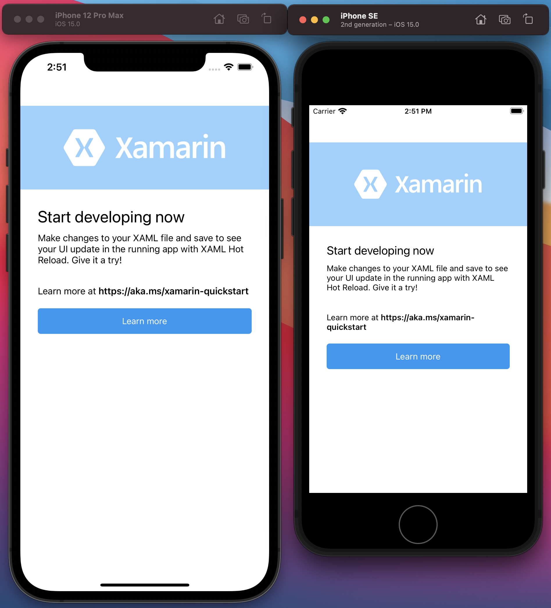

# Xamarin.DeviceDensity.Plugin

[](https://www.nuget.org/packages/Xamarin.DeviceDensity.Plugin/)

A Xamarin.Forms library to help with building a pixel perfect UI/UX across multiple screen size.
While building a mobile application one needs to support multiple device screen size used by users as mobile devices comes in all shapes and sizes so your app layout needs to be flexible and your layout should gracefully respond to different screen sizes and orientations.
[Android](https://developer.android.com/guide/topics/large-screens/support-different-screen-sizes#alternative-layouts) uses alternative layout to fix that. While  [iOS](https://developer.apple.com/design/human-interface-guidelines/ios/visual-design/adaptivity-and-layout/) uses adaptive layout concept to go around that. This package uses the device screen denisty to set the appropriate value for whatever you need it for. Be it Label font size or Button corner radius and even Frame height etc.

To further understand why device density is key to achieving this is explained by [dpilove](https://dpi.lv/)
>In the context of screens, DPI (Dots Per Inch) or PPI (Pixels Per Inch) refer to the number of device pixels per inch, also called “pixel density”. The higher the number, the smaller the size of the pixels, so graphics are perceived as more crisp and less pixelated.

Each mobile device has a device density which ranges from 1.0 through to ~4.0.


## Setup
- To use the library in your project, follow the step(s) below. 

1. Download the latest version through [NuGet](https://www.nuget.org/packages/Xamarin.DeviceDensity.Plugin/) and install it in your Xamarin.Forms standard project.

# How to use
1. Add this line to your `xaml`

```xml
xmlns:density="clr-namespace:Xamarin.DeviceDensity.Plugin;assembly=Xamarin.DeviceDensity.Plugin"
```

2. For any view property that needs to vary across device density.
For instance, a `Label` that needs to render differently on multiple device density.
```xml
<Label FontSize="{density:OnScreenDensityDouble Default=10, OnePointZero=8, OnePointFive=8, TwoPointZero=10, TwoPointFive=10, ThreePointZero=12, ThreePointFive=12, FourPointZero=14}" Text="Start developing now" />
```

Or a `Button` that has different corner radius across multiple device screen.
```xml
<Button CornerRadius="{density:OnScreenDensityDouble Default=10, OnePointZero=8, OnePointFive=8, TwoPointZero=10, TwoPointFive=10, ThreePointZero=12, ThreePointFive=12, FourPointZero=14}" Text="Start developing now" />
```

# Images

Below are screenshots of a file new Xamarin forms shell project before making use of the plugin. The iPhone 12 Pro Max uses a 3.0 density while the iPhone SE makes use of 2.0 device density,

## Before
<br/>


<br/>
<br/>

## After
You can see how crisp the layout looks on both screen type.
<br/>
<br/>

